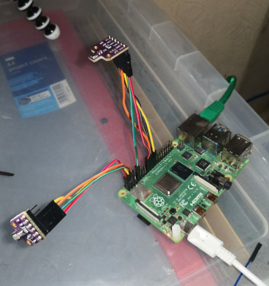
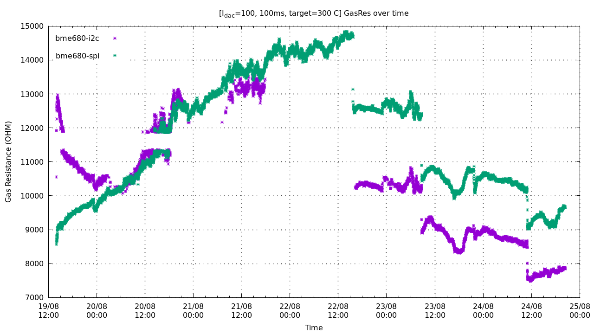
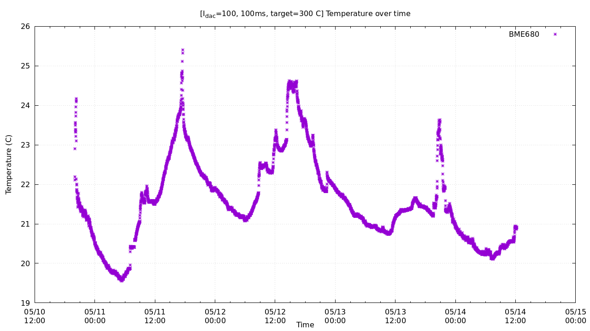
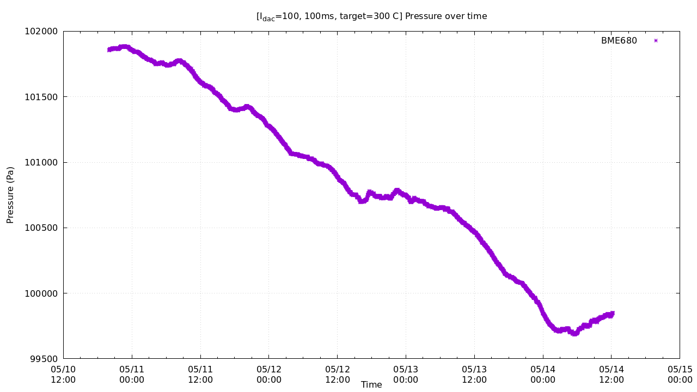
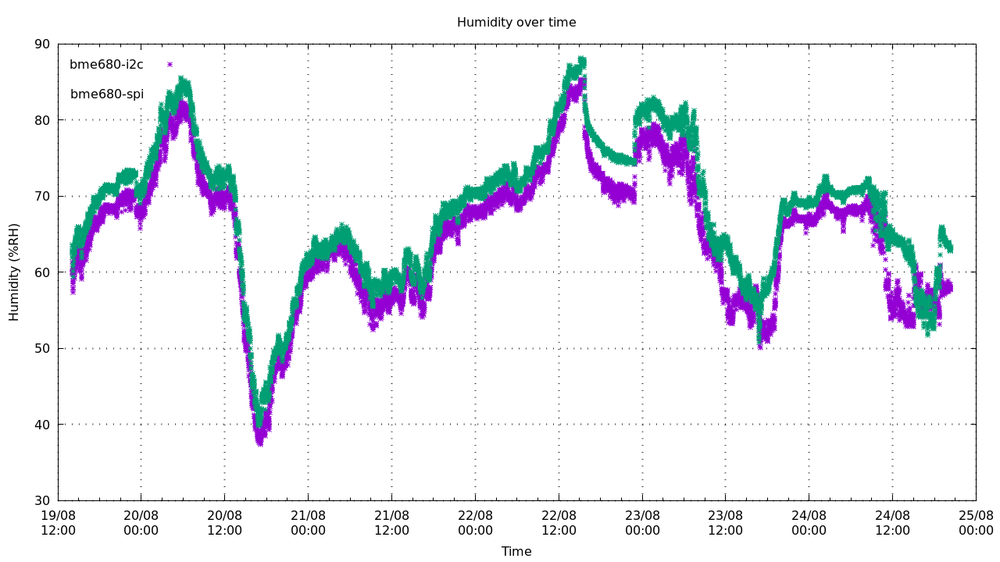

# bme680

Example implementation of BME680 software. The I2C/SPI drivers are meant to run on a Raspberry Pi 4.




Connecting the purple BME680 module board to SPI:

| SPI func | BME680 Pin | Raspberry Pi Pin |
| -------- | ---------- | ---------------- |
| MISO     | "SDO"      | GPIO 9 (Pin 21)  |
| MOSI     | "SDA"      | GPIO 10 (Pin 19) |
| SCLK     | "SCL"      | GPIO 11 (Pin 23) |
| CS       | "CS"       | GPIO 8 (Pin 24)  |

### build
Run `make` to build demo programs `bme680_spi` and `bme680_i2c` that use the pins/dev configured in `spi.c` and `i2c.c`

Also `make log` creates spi and i2c versions of the log program

## spi demo
```
par_t1: 26203
par_t2: 26519
par_t3: 3
par_p1: 35008
par_p2: -10284
par_p3: 88
par_p4: 9692
par_p5: -202
par_p6: 30
par_p7: 24
par_p8: -4
par_p9: -3469
par_p10: 30
par_h1: 794
par_h2: 1007
par_h3: 0
par_h4: 45
par_h5: 20
par_h6: 120
par_h7: -100
par_g1: 208
par_g2: 59781
par_g3: 18
range_switching_error: 19
res_heat_range: 1
res_heat_val: 46
float mode
tfine: 104906.162500
temp: 20.489485 degC
press: 100089.609193 Pa
humidity: 64.456540 % RH
gas resistance: 12100.310308 Ohm
== for heater target=300.0 and ambient temp=19.0 (degC)
=== gas_valid_r: 1
=== heat_stab_r: 1
```

## i2c demo
```
par_t1: 26125
par_t2: 26370
par_t3: 3
par_p1: 36262
par_p2: -10371
par_p3: 88
par_p4: 6713
par_p5: -103
par_p6: 30
par_p7: 31
par_p8: -251
par_p9: -3158
par_p10: 30
par_h1: 776
par_h2: 1010
par_h3: 0
par_h4: 45
par_h5: 20
par_h6: 120
par_h7: -100
par_g1: 183
par_g2: 59281
par_g3: 18
range_switching_error: 19
res_heat_range: 1
res_heat_val: 39
float mode
tfine: 97289.819111
temp: 19.001918 degC
press: 100226.479673 Pa
humidity: 67.022216 % RH
gas resistance: 14702.868852 Ohm
== for heater target=300.0 and ambient temp=19.0 (degC)
=== gas_valid_r: 1
=== heat_stab_r: 1
```

Note: Do not trust the gas resistance measurement if `heat_stab_r` is not `1`.

## Burn-in / logging

See file `example/log.c` 






Compile and run
```sh
stdbuf -o0 ./bme680 2>&1 | tee -a log.txt
```

This will give an output similar to this:
```
2024-05-14T13:03:02+0100 20.8916 99836.7 68.6594 7180.73 1
2024-05-14T13:04:03+0100 20.8658 99840.3 68.7844 7171.53 1
2024-05-14T13:05:03+0100 20.8979 99838.6 68.7759 7162.35 1
2024-05-14T13:06:03+0100 20.9208 99843.8 68.6436 7166.93 1
2024-05-14T13:07:03+0100 20.9303 99845.4 68.747 7144.05 1
2024-05-14T13:08:03+0100 20.9249 99846 68.7122 7139.49 0
2024-05-14T13:09:04+0100 20.9036 99845.2 68.7224 7157.76 1
2024-05-14T13:10:04+0100 20.8737 99850.5 68.575 7144.05 1
2024-05-14T13:11:04+0100 20.8753 99850.6 68.8879 7139.49 1
2024-05-14T13:12:04+0100 20.9152 99849.3 68.8602 7134.94 1
```

If last field is not 1 then the measurement, at least for gas resistance, cannot be trusted.
```sh
sed -n '/1$/p' log.txt > test.txt
```

Then graph with gnuplot
```
# gnuplot
reset

set key autotitle columnhead
set terminal pngcairo enhanced size 2*1920/3,2*1080/3
set grid
set xdata time
set timefmt "%Y-%m-%dT%H:%M:%S%z"


# gas res vs time 
set title "[I_{dac}=100, 100ms, target=300 C] GasRes over time"
set xlabel "Time"
set ylabel "Gas Resistance (OHM)"
set output "gas.png"
plot 'test.txt' u 1:5 w p pt 3 ps 1 t "BME680"


set title "[I_{dac}=100, 100ms, target=300 C] Temperature over time"
set xlabel "Time"
set ylabel "Temperature (C)"
set output "temp.png"
plot 'test.txt' u 1:2 w p pt 3 ps 1 t "BME680"

set title "[I_{dac}=100, 100ms, target=300 C] Pressure over time"
set xlabel "Time"
set ylabel "Pressure (Pa)"
set output "press.png"
plot 'test.txt' u 1:3 w p pt 3 ps 1 t "BME680"

set title "[I_{dac}=100, 100ms, target=300 C] Humidity over time"
set xlabel "Time"
set ylabel "Humidity (%RH)"
set output "hum.png"
plot 'test.txt' u 1:4 w p pt 3 ps 1 t "BME680"
```
