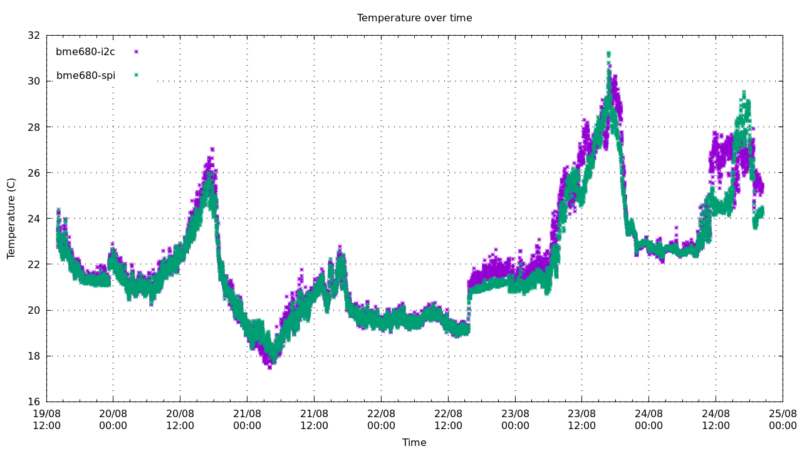
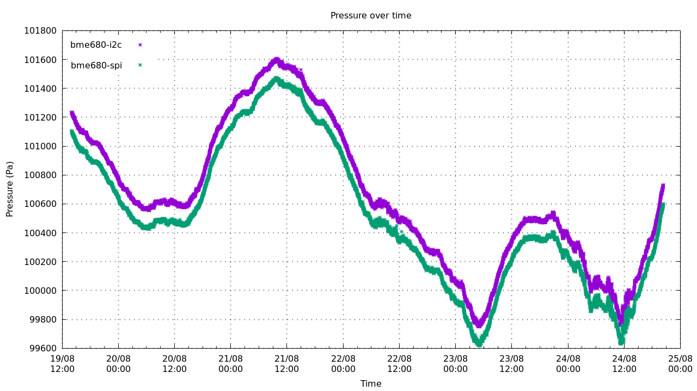

# bme680

Example implementation of BME680 software. The I2C/SPI drivers are meant to run on a Raspberry Pi 4.


Connecting the purple BME680 module board to SPI:

| SPI func | BME680 Pin | Raspberry Pi Pin |
| -------- | ---------- | ---------------- |
| MISO     | "SDO"      | GPIO 9 (Pin 21)  |
| MOSI     | "SDA"      | GPIO 10 (Pin 19) |
| SCLK     | "SCL"      | GPIO 11 (Pin 23) |
| CS       | "CS"       | GPIO 8 (Pin 24)  |

### build
```sh
$ make
```
This will create demo programs `bme680_i2c` and `bme680_spi`, and logging programs `bme680_log_i2c` and `bme680_log_spi`. They all expect the pin/devices specified in `spi.c` and `i2c.c`.

The loggers spit out the following every minute:
```
2024-08-19T18:20:00+0100 22.2358 101068 65.8092 11054.4 1
```
`Date`, `Temperature °C`, `Pressure Pa`, `% RH`, `Measured Gas resistance Ω`, `Heat stability bit`

>Note: disregard measured gas resistance if the heat stability bit is not 1.

## bme680_{i2c,spi} demo output
```
par_t1: 26203
par_t2: 26519
par_t3: 3
par_p1: 35008
par_p2: -10284
par_p3: 88
par_p4: 9692
par_p5: -202
par_p6: 30
par_p7: 24
par_p8: -4
par_p9: -3469
par_p10: 30
par_h1: 794
par_h2: 1007
par_h3: 0
par_h4: 45
par_h5: 20
par_h6: 120
par_h7: -100
par_g1: 208
par_g2: 59781
par_g3: 18
range_switching_error: 19
res_heat_range: 1
res_heat_val: 46
float mode
tfine: 104906.162500
temp: 20.489485 degC
press: 100089.609193 Pa
humidity: 64.456540 % RH
gas resistance: 12100.310308 Ohm
== for heater target=300.0 and ambient temp=19.0 (degC)
=== gas_valid_r: 1
=== heat_stab_r: 1
```

## Burn-in / logging

See file `cmd/log.c` 






Compile and run
```sh
$ make
$ mkdir data
$ stdbuf -o0 ./bme680_log_i2c 2>&1 | tee -a data/i2c.txt &
$ stdbuf -o0 ./bme680_log_spi 2>&1 | tee -a data/spi.txt &
# wait a couple of hours or days ..
$ cd plot
$ ./plot.sh
```

This project is licensed under the terms of the GNU General Public License v2.0.